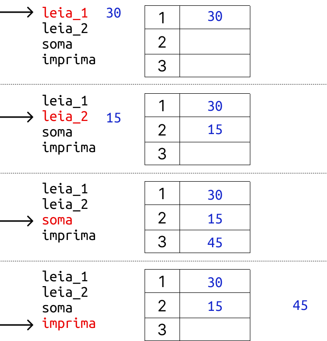
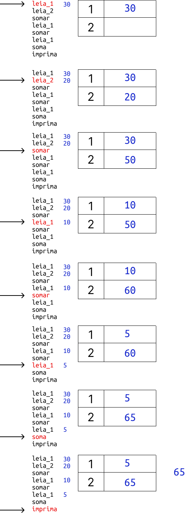
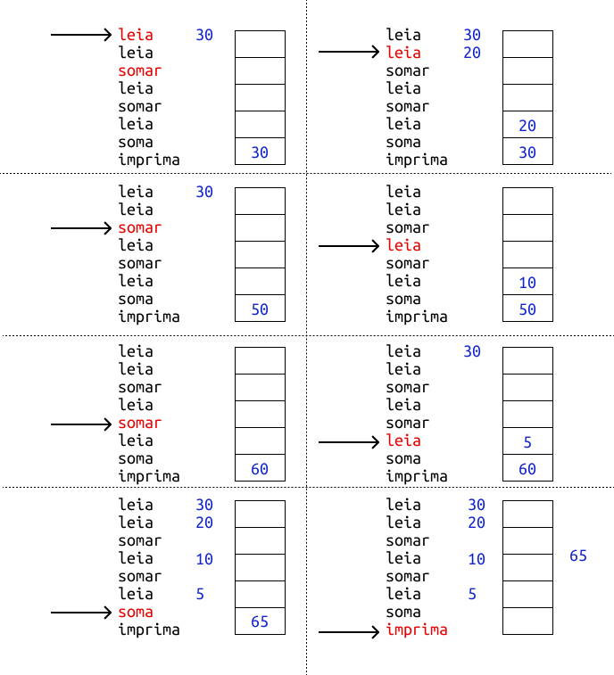

# Almost There!

É possível aprender uma linguagem de programação sem aprender a programar! Basta aprender uma gramática qualquer, como se fosse um novo idioma. Porém, saber uma linguagem de programação não te torna um programador.

Um programador ou desenvolvedor é aquele que usa um computador para realizar tarefas úteis. Para uma tarefa ser útil, normalmente ela envolve alguma coisa correlacionada ao mundo real. E ser um programador é muito mais do que saber uma linguagem de programação. É ser capaz de abstrair modelos complexos de forma a executá-los em um ambiente limitado como um computador.

Dessa forma, postergamos o início da nossa jornada ao ruby para tratar de fundamentos necessários para se tornar um programador. Daí vem uma afirmação, talvez até um pouco polêmica:

`Se você não é capaz de programar no papel, então você ainda não é um programador`

## Vamos criar nossa própria linguagem de programação?

Que tal criarmos uma nova linguagem de programação?
Com isso, vamos poder introduzir em um ambiente controlado os conceitos que serão muito importantes ao longo dessa jornada que se inicia.

### O que é uma linguagem de programação?

Uma linguagem de programação é um dialeto controlado e limitado que serve para instruir a um computador o que ele deve fazer. Para criar uma linguagem de programação precisamos ter um computador para ser programado. Então vamos lá! Criaremos nosso próprio computador.

Um computador tem por objetivo mais genérico transformar uma dada entrada em uma saída. Por exemplo, dado que a entrada é `1+3` e que o computador foi programado para realizar somas, então esperamos que o resultado seja `4`.

Além disso, para ser um computador, ele precisar ter a capacidade de ser programado. Ou seja, ele precisa ser flexível para ser genérico e resolver problemas para os quais ele não foi concebido inicialmente.

Nosso computador será muito simples, como o da imagem abaixo. Ele terá um dispositivo para entrada de dados; um teclado; uma unidade de processamento (CPU); uma memória; e uma tela fazendo o papel do dispositivo de saída.


## RAPL

Apresentamos a RAPL (Raro Academy Programing Language). Ela será a linguagem de programação que iremos construir. E com ela vem a primeira lição que deve ser levada por toda a sua jornada como programador:


> É mais fácil resolver um problema complexo resolvendo pequenos problemas simples e compor essas pequenas soluções para resolver um problema complexo.


Então começaremos bem simples. Nossa Linguagem de programação (LP daqui pra frente), deve ser capaz apenas de somar dois números inteiros.

Existem diferentes paradigmas de linguagens de programação tais como o imperativo, o funcional e o lógico.

As linguagens imperativas são aquelas em que o programador diz passo a passo o que o computador deve fazer, e elas são próximas do funcionamento do computador em si. Usando comandos, o programador descreve como o computador deve se comportar a cada *mudança de estado*. As linguagens imperativas foram as primeiras a se popularizarem e ainda são as mais populares.

Já as linguagens do paradigma funcional utilizam a pureza da matemática para que o programador diga ao computador o que deve ser feito, e não como deve ser feito. Linguagens funcionais são tão antigas quanto as imperativas, mas têm ganhado popularidade por terem propriedades que facilitam a programação de sistemas que lidam com grandes volumes de dados.

Por fim, as linguagens do paradigma lógico permitem que o programador escreva um conjunto de fatos lógicos e peça ao computador para inferir o resultado.

As linguagens mais populares do momento têm como base os fundamentos das linguagens imperativas, mas disponibilizam recursos do mundo funcional. É o caso da linguagem Ruby que será objeto de estudo nesse curso.

Voltemos para nossa linguagem RAPL. Ela terá como base o paradigma imperativo. Isso significa que precisamos criar alguns comandos para que o computador aceite nossas ordens. Chamaremos esses comandos de instruções.

Queremos que nossa LP seja capaz de realizar a soma de dois números simples. Para isso, é necessário ler do teclado o primeiro e segundo números, realizar a soma, e mostrar o resultado na tela. Temos aqui as 4 instruções que precisamos implementar em nossa LP:

### RAPL v1

| Instrução | Semântica                                                                                                                                  |
|-----------|--------------------------------------------------------------------------------------------------------------------------------------------|
| leia_1    | leia um número do teclado e armazene o valor lido na posição 1 da memória                                                                  |
| leia_2    | leia um número do teclado e armazene o valor lido na posição 2 da memória                                                                  |
| somar     | some o valor armazenado a posição 1 da memoria com o valor armazenado na posição 2 da memória e guarde o resultado na posição 3 da memoria |
| imprimir  | mostre no monitor o valor armazenado na posição 3 da memória                                                                               |

Ok. Já temos nossa limitada v1 da RAPL. Vamos então executar nosso programa:



A primeira versão da nossa LP não faz nada de útil mas, se observarmos bem, ela revela um conceito fundamental no universo da programação imperativa: *A mudança de estado*.

Toda vez que a memória é alterada dizemos que houve uma mutação em seu estado. É como se uma fotografia fosse tirada a cada mínima mudança. A sobreposição dessas fotos conta a história da computação realizada e guia o programa até o término de sua execução, produzindo a saída esperada.


### RAPL v1.1

Vamos aumentar um pouco a capacidade da nossa LP. Agora precisamos que ela some uma série de tamanho arbitrário de números, e não apenas dois.

O que devemos fazer? Criar novas instruções? Poderia ser um caminho, mas iremos exercitar o conceito mais importante de um programador: a abstração.

> Programar é a arte de abstrair

Temos um ambiente limitado, o computador, e temos um problema especifico a ser resolvido. Abstrair é a capacidade de deixar de fora os aspectos irrelevantes do contexto do problema a fim de que os aspectos essenciais possam ser executados em um computador. Em outras palavras, é fazer muito com quase nada.

Dessa forma, ao invés de criar novos comandos para nossa LP, vamos apenas alterar a semântica de um deles e nossa LP passará a servir ao propósito de realizar a soma de uma série de números.


| Instrução | Semântica                                                                                                                                  |
|-----------|--------------------------------------------------------------------------------------------------------------------------------------------|
| somar     | some o valor armazenado na posição 1 da memória com o valor armazenado na posição 2 da memória e guarde o resultado na posição 2 da memória |


Pronto. Com essa pequena alteração na semântica do comando somar, podemos nos beneficiar das mutações de estados e aumentar a capacidade da nossa LP:




### RAPL v2

Já entendemos bem o problema e temos uma versão funcional de uma LP capaz de executar uma soma de números. Nosso desafio agora é maior: precisamos escrever um programa para processar notas de um aluno. Dada uma sequência de notas, se a soma delas for maior ou igual a 60, então devemos imprimir na tela a palavra "aprovado". Se for menor que 60 devemos imprimir na tela a palavra "reprovado".

Novamente devemos separar um problema complexo em pequenos problemas. E toda vez que formos evoluir nossa solução, devemos pensar em como melhorar o que fizemos até agora para que a solução cresça de forma orgânica e mais genérica. Isso nos trará muitos benefícios no futuro, sendo o principal deles a facilidade de manutenção em nossos códigos.

Como optamos no primeiro momento por fazer o mais simples possível, reduzimos proporcionalmente a capacidade que ter uma memória nos oferece. Uma forma de potencializar o uso da memória é pensá-la como estrutura de dados chamada *pilha*.

#### Nossa primeira estrutura de dados: Pilha

Estruturas de dados são abstrações de como organizar dados e operá-los de forma a facilitar a resolução de alguns problemas. É como se fosse um catálogo de boas soluções para alguns problemas comuns que foi nos deixado por nossos antepassados.

Entre as estruturas de dados mais versáteis está a Pilha. Para entender a Pilha, começaremos por outra estrutura de dados também muito comum, a Fila.

Uma Fila é uma estrutura de dados que organiza o momento em que um dado processamento ocorre. É exatamente como no mundo real. Imagine que você vá ao banco para realizar um pagamento. Se o caixa não estiver livre você irá aguardar em uma fila. A fila tem por característica priorizar o processamento pela ordem de chegada. Por isso, o nome que usamos para fila na computação é FIFO (First In First Out). Ou seja, o primeiro a chegar é o primeiro a sair.

Já a pilha tem o comportamento inverso ao da fila. Dizemos que uma pilha é FILO (First In Last Out). O primeiro a chegar é o último a sair.

Imagine que você tem uma coleção de livros do mesmo tamanho (largura e comprimento).
E como são livros especiais e raros, você encomendou um caixa que é a conta da dimensão dos livros e tem a altura da sua coleção. Você coloca seus livros nessa caixa, ou melhor dizendo, você empilha os livros nessa caixa, organizando-os pela data de lançamento, colocando os mais antigos no fundo da caixa. Agora você que reler o primeiro livro.


Para acessá-los, quantos livros você terá que tirar da caixa?

Sim, todos os anteriores.

Por isso, o primeiro a chegar é o último a sair.

A partir de agora trataremos nossa memória como sendo uma pilha.
Dessa forma, só podemos ter duas operações possíveis em nossa memória: empilhar e desempilhar.

Vamos redefinir a semântica dos nossos comandos para se adaptar a nossa nova memória:

| Instrução  | Semântica                                                                                                                                  |
|------------|--------------------------------------------------------------------------------------------------------------------------------------------|
| ~~leia_1~~ | descontinuada                                                                 |
| ~~leia_2~~ | descontinuada                                                                  |
| leia       | leia um valor do teclado e coloque no topo da pilha
| desempilhar| retire o valor do topo da pilha
| somar      | desempilhe duas vezes e some os valores e empilhe o resultado |
| imprimir   | imprima o valor no topo da pilha                                                                               |


Ok. Antes de conseguir evoluir para resolver o problema real, nós fizemos uma alteração para ter mais flexibilidade e tornar as coisas mais simples no futuro. E é isso que costumamos chamar no dia a dia de _refactor_.

>Refatorar é melhorar continuamente aquilo que já fizemos para algo cada vez mais robusto e flexível

O _refactor_ deve surgir sempre em cima de uma necessidade e não por capricho.
Isso é importante para que não gastemos todo o nosso tempo criando uma base de código perfeita que não resolve um problema real.

Vamos ver como fica nosso programa com as novas instruções:



Apesar da mudança, nenhuma nova capacidade foi adicionada a nossa LP.
Vamos revisitar o requisito original:


```
Dada uma sequência de notas, se a soma
delas forma maior ou igual a 60 então devemos imprimir na tela a
palavra "aprovado". Se for menor que 60 devemos imprimir na tela a
palavra "reprovado".
```

Atualmente, conseguimos ler uma sequência de notas e somá-las, mas não temos nenhum mecanismo para verificar se um aluno foi aprovado ou reprovado. Também não temos a capacidade de imprimir na tela uma mensagem textual. Dessa forma, adicionar essas duas capacidades é nossa próxima tarefa.

#### Lógica Booleana

Na lógica Booleana (de [George Boole](https://en.wikipedia.org/wiki/George_Boole)), os valores se resumem a dois: verdadeiro ou falso. Dada uma sequência de operadores unitários ou binários, o resultado sempre será ou verdadeiro ou falso.

Os computadores mais tradicionais são máquinas binárias, ou seja, todo o processamento -  seja a soma de dois números ou o mais avançado algoritimo de _machine learning_ - é abstraído de forma a ser representado por valores binários 0 ou 1. Verdadeiro ou falso.

Ao chegar no final da soma das notas, precisamos determinar se o aluno obteve 60 pontos ou mais. Podemos abstrair e dizer que *verdadeiro* significa aprovado e *falso* significa reprovado. Vamos então definir uma nova instrução em nossa LP. Essa instrução deve ser um operador lógico binário, ou seja, que receba dois operandos (valores) e determine se a condição resultante é *verdadeira* ou *falsa*. A seguir a definição da nossa nova instrução:

| Instrução  | Semântica                                                                                                                                  |
|------------|--------------------------------------------------------------------------------------------------------------------------------------------|
| maior_igual| desempilha duas vezes e compara se o segundo valor desempilhado é maior ou igual ao primeiro. Empilha o segundo valor e em seguida o resultado boleano|                          |

Ainda falta um coisa. Até agora só conseguimos colocar valores no topo da pilha pela instrução *leia*, que obtém um valor diretamente do teclado. Precisamos de algo que nos permita adicionar um valor constante na pilha:

| Instrução  | Semântica                                                                                                                                  |
|------------|--------------------------------------------------------------------------------------------------------------------------------------------|
| empilhar <valor>  | empilha o valor passado como parâmetro|


Pronto. Agora podemos escrever um programa assim:

```
01 leia
02 leia
03 somar
04 leia
05 somar
06 leia
07 somar
08 empilhar 60
09 maior_que
```

Supondo que as entradas do teclado sejam em sequência 10,20,30,10,60, as seguintes mutações terão acontecido na memória:

```
(0) [10]
(1) [20,10]
(2) [30]
(3) [30,30]
(4) [60]
(5) [10,60]
(6) [70]
(7) [60,70]
```

Ao executar a instrução *maior_que*, iremos pegar o primeiro valor `60` retirando-o do topo da pilha, em seguida, o segundo valor `70` também retirando-o do topo da pilha.
Segundo a semântica da nossa instrução, se o segundo valor `70` for maior ou igual ao primeiro valor `60`, devemos colocar novamente o segundo valor na pilha seguido do valor verdadeiro. Iremos representar os valores verdadeiro e falso com as palavras em inglês `true` e `false`. Logo, na última mutação que nosso programa causar na memória, o seu estado final deve ficar assim:

```
(8) [true,70]
```

Quase lá! Já sabemos que, para essa execução, devemos mostrar na tela "aprovado" já que a soma das notas foi de '70', ou seja, maior ou igual a '60'. Porém, não temos nenhum mecanismo em nossa LP que nos permita decidir qual rumo tomar. Para isso, precisamos adicionar uma capacidade muito importante: o desvio condicional.


#### Desvio de condições

Quando estamos processando dados, ou seja, transformando entradas em saídas, de acordo com alguma condição (em nosso exemplo, verificar se o aluno foi aprovado ou não) precisamos executar instruções condicionadas a algo que tenha sido verificado anteriormente.
A estrutura condicional mais simples que existe em uma LP imperativa é o *SE*. O famoso _if_ em inglês. Uma instrução condicional define se devemos tomar um desvio no fluxo de execução do nosso programa SE uma determinada condição for atendida.

Vamos adicionar novas instruções em nossa LP:


| Instrução    | Semântica                                                                                                                                  |
|--------------|--------------------------------------------------------------------------------------------------------------------------------------------|
| se <label>   | desempilha, se o valor desempilhado for verdadeiro salta o fluxo de execução para o local indicado no parâmetro label                      |
| label <nome> | rotula um trecho de código com um nome para que ele possa ser alvo de um desvio de fluxo
| fim          | para a execução do programa

Podemos então modificar o programa para desviar o fluxo caso o aluno seja aprovado:

```
01 leia
02 leia
03 somar
04 leia
05 somar
06 leia
07 somar
08 empilhar 60
09 maior_que
10 se aprovado
11 empilhar "reprovado"
12 imprimir
12 fim
13 label aprovado
14 empilhar "aprovado"
15 imprimir
```

Nosso programa agora é capaz de resolver o problema proposto. Mas, tem algo que você deve estar se perguntado. Como nossa memória suporta textos, número e até valores booleanos ao mesmo tempo?
Bem, isso é algo que ainda não definimos e iremos fazer na sequência.

#### Tipos de Dados Primitivos

Na prática, um chip de memória é um componente eletrônico que armazena somente valores binários. Para facilitar, normalmente as linguagens de programação _vêm de fábrica_ com algumas abstrações já prontas que mapeiam blocos de memória binária em tipos de dados mais amigáveis. Nossa LP irá oferecer automaticamente 3 abstrações de tipos primitivos:

* Boolean
Valores true ou false mapeados em um único *bit* na memória.

* Inteiros
Números inteiros positivos de 0 a 65.536 mapeados em um *byte* na memória

* Strings
Sequência de caracteres onde cada caracter é representado por um número inteiro de 0 a 128 e definidos pela tabela ASCII de tamanho arbitrário.

Em nossa linguagem, a abstração de tipo primitivo será dinâmica, não sendo necessário especificar previamente o tipo de dado desejado. Assim, com base no que parece ser o valor, o tipo será automaticamente inferido.

Antes de continuar, veja que coisa mais linda. O computador só suporta 0 ou 1, mas fomos capazes de criar abstrações que se utilizam de umas às outras para poder representar algo muito mais complexo, como um texto:


### RAPL v3

Ainda falta um aspecto muito importante para conseguirmos implementar o nosso programa.
Vamos revisitar a especificação:

```
Dada uma sequência de notas, se a soma
delas for maior ou igual a 60 então devemos imprimir na tela a
palavra "aprovado". Se for menor que 60 devemos imprimir na tela a
palavra "reprovado".
```


Até agora nossa LP só é capaz de processar um número pré-estabelecido de notas. A especificação diz que devemos processar uma sequência, mas não diz quantas notas existirão nessa sequência.

Assim, precisamos introduzir um elemento fundamental das linguagens imperativas: estruturas de repetição.

#### Estruturas de Repetição

Para tornar nossos programas mais poderosos, podemos reprocessar, por quantas vezes forem necessárias, uma parte do código que já escrevemos. Esse reprocessamento das instruções irá ocorrer até que uma determinada condição faça o fluxo ser desviado.

Vamos definir nossa primeira instrução para controlar a repetição.

| Instrução    | Semântica                                                                                                                                  |
|--------------|--------------------------------------------------------------------------------------------------------------------------------------------|
| repita       | desempilhe. execute o bloco com as instruções seguintes se o valor for verdadeiro. Execute até encontrar a instrução fim_repita                |
| fim_repita   | determina o fim do bloco de instruções de uma instrução repita

Vamos considerar que as notas são de 0 a 100 e que qualquer valor maior que 100 informado pelo usuário significa que ele não tem mais notas para serem processadas. O novo programa deve ficar assim:

```
01 empilhe 0
02 empilhe true
03 repita
04 leia
05 empilhar 100
06 maior_igual
07 se mostrar_resultado
08 somar
09 empilhar true
10 fim_repita
11 label mostrar_resultado
12 empilhar 60
13 maior_que
14 se aprovado
15 empilhar "reprovado"
15 imprimir
17 fim
18 label aprovado
19 empilhar "aprovado"
20 imprimir
```

Ao executar para as entradas 10,20,15,999 as seguintes mutações de estado deveriam ocorrer na memória:

Iteração 1

```
empilhe 0                     | (1) [0]
empilhe true                  | (2) [true,0]
repita                        | (3) [0]
leia                          | (4) [10,0]
empilhar 100                  | (5) [100,10,0]
maior_igual                   | (6) [false,10,0]
se mostrar_resultado          | (7) [10,0]
somar                         | (8) [10]
empilhar true                 | (9) [true,10]
fim_repita                    |
label mostrar_resultado       |
desempilhar                   |
empilhar 60                   |
maior_que                     |
se aprovado                   |
empilhar "reprovado"          |
imprimir                      |
fim
label aprovado
empilhar "aprovado"
imprimir
```
Iteração 2

```
repita                       | (10) [10]
leia                         | (11) [20,10]
empilhar 100                 | (12) [100,20,10]
maior_igual                  | (13) [false, 20, 10]
se mostrar_resultado         | (14) [20, 10]
somar                        | (15) [30]
empilhar true                | (16) [true, 30]
fim_repita                   |
```
Iteração 3

```
repita                       | (17) [30]
leia                         | (18) [15,30]
empilhar 100                 | (19) [100, 15, 30]
maior_igual                  | (20) [false, 15, 30]
se mostrar_resultado         | (21) [15, 30]
somar                        | (22) [45]
empilhar true                | (23) [true, 45]
fim_repita                   |
```
Iteração 4

```
repita                       | (24) [45]
leia                         | (25) [999,45]
empilhar 100                 | (26) [100, 999, 45]
maior_igual                  | (27) [true, 999, 45]
se mostrar_resultado         | (28) [999, 45]
somar                        | (29)
empilhar true                | (30)
fim_repita                   | (31)
label mostrar_resultado      | (32) [45]
empilhar 60                  | (33) [60,45]
maior_que                    | (34) [false, 45]
se aprovado                  | (35) [45]
empilhar "reprovado"         | (36) ["reprovado", 45]
imprimir                     | (37) [45]
fim
label aprovado
empilhar "aprovado"
imprimir
```


Ótimo! Podemos considerar que nossa LP ganhou o status de ser uma linguagem de programação 'turing complete'.


Isso quer dizer que nossa linguagem tem a mesma capacidade de processamento de qualquer outra linguagem de programação real.


Na próxima aula iremos incrementar nossa linguagem para que possamos observar aspectos mais avançados de uma linguagem de programação. E depois iremos ver esses conceitos em uma linguagem popular que é o Ruby.

## Hora de Mais um Refactor

Nossa primeira versão da memória tinha um tamanho fixo e apenas três posições onde as leituras e gravações estavam explícitas em nossos comandos.

Em nosso primeiro _refactor_ transformamos a memória em uma pilha. Isso nos deu uma boa flexibilidade e já podíamos usar as posições sem nos preocuparmos com o seu endereçamento e tamanho.

Preparando nossa linguagem para novos desafios iremos agora fazer um _refactor_ para tratar a memória de forma diferente.

Vamos adicionar a capacidade de dar um nome para cada pedaço de memória que utilizamos em nosso programa e utilizar esse nome para ser a referência de acesso à memória para leitura e gravação.

Assim, passaremos a ter duas memórias: uma em formato de pilha e outra de acesso por um nome.

Vamos então definir mais algumas instruções, renomear nossas instruções para o inglês e mudar a semântica de outras já definidas. Nossa lista de instruções ficará assim:

| Instrução                  | Semântica                                                                                                                                  |
|----------------------------|--------------------------------------------------------------------------------------------------------------------------------------------|
| keyboard                   | leia um valor do teclado e coloque no topo da pilha |
| push <value>               | empilha o valor constante passado como parâmetro |
| pop                        | retire o valor do topo da pilha |
| print                      | mostre no monitor o valor armazenado no topo da pilha |
| sum                        | desempilhe duas vezes e some os valores. Empilhe o resultado |
| subtract                   | desempilhe duas vezes e subtraia o primeiro do segundo valor. Empilhe o resultado |
| multiply                   | desempilhe duas vezes e multiplique os valores. Empilhe o resultado |
| divide                     | desempilhe duas vezes e divida os valores. Empilhe o resultado |
| module                     | desempilhe duas vezes e calcule o modulo da divisão dos valores. Empilhe o resultado |
| greater_than               | desempilha duas vezes e compara se o segundo valor desempilhado é maior ou igual que primeiro. Empilha o resultado da comparação|
| greater                    | desempilha duas vezes e compara se o segundo valor desempilhado é maior que primeiro. Empilha o resultado da comparação|
| less_than                  | desempilha duas vezes e compara se o segundo valor desempilhado é menor ou igual que primeiro. Empilha o resultado da comparação o resultado|
| less                       | desempilha duas vezes e compara se o segundo valor desempilhado é menor que primeiro. Empilha o resultado da comparação|
| equal                      | desempilha duas vezes e compara se o segundo valor desempilhado é igual ao primeiro. Empilha o resultado da comparação |
| not_equal                  | desempilha duas vezes e compara se o segundo valor desempilhado é diferente do primeiro. Empilha o resultado da comparação |
| if <condition> <label>     | executa a instrução de condição e se o resultado for verdadeiro salte a execução para o label indicado |
| unless <condition> <label> | executa a instrução de condição e se o resultado for false salte a execução para o label indicado |
| end                        | para a execução do programa
| repeat <condition>         | executa a instrução de condição e se o resultado for verdadeiro executa as próximas instruções até encontrar a instrução end_repeat |
| end_repeat                 | determina o fim do bloco de instruções de uma instrução repeat
| label <name>               | rotula um trecho de código com um nome para que ele possa ser alvo de um desvio de fluxo
| store <name>               | Desempilha e guarda o valor desempilhado uma posição da memória definido pelo parâmetro nome                                            |
| read <name>                | coloca no topo da pilha o valor armazenado em uma posição da memória definido pelo parâmetro nome                             |


Quando associamos um nome a uma posição especifica de memória dizemos que temos uma *variável* ou *constante*.
Se o valor da posição puder ser alterado durante o tempo de execução, temos uma variável, se o valor não puder ser alterado, temos uma constante.

Vamos reescrever o nosso programa considerando essas novas capacidades. Ao invés de utilizar um valor maior que 100 para encerrar a leitura das notas, vamos perguntar ao usuário quantas notas ele deseja informar. A especificação deve ficar assim:


```
Pergunte ao usuário quantas notas ele deseja informar. Leia as notas informadas.
Se a soma delas for maior ou igual a 60 então devemos imprimir na tela a
palavra "aprovado". Se for menor que 60 devemos imprimir na tela a
palavra "reprovado".
```

Podemos escrever um programa assim:

```
push 0
store soma
push "Quantas notas deseja informar:"
print
keyboard
store quantidade
push 0
repeat greater
    keyboard
    read soma
    sum
    store soma
    read quantidade
    push 1
    subtract
    store quantidade
    read quantidade
    push 0
end_repeat
push 60
if greater_than aprovado
push "Reprovado"
print
end
label aprovado
push "Aprovado
print
```


