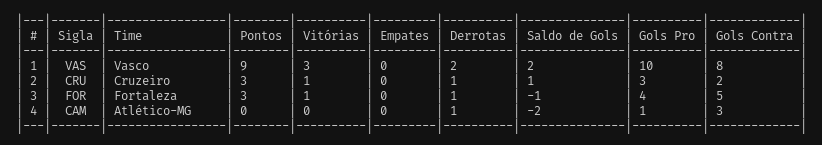

# Brasfut

## Projeto

O projeto de estudo consiste em criar uma aplicação em ruby que gera uma tabela de classificação de um campeonato de futebol. Completar os métodos necessários para que o programa funcione corretamente.

**ENUNCIADO**: Completar os seguintes métodos

- [x] criar_rodadas!

Implementar a geração automática da tabela
considerando que todos os times devem
jogar entre sí em turno e returno
uma vez como mandante e outra como visitante

- [x] imprimir_tabela

Implementar um método que retorne uma string
representando a tabela de jogos no seguinte formato
RODADA <numero da rodada>

CAM X CRU
VAS X FOR

RODADA <numero da rodada>

CAM X CRU
VAS X FOR

- [x] imprimir_classificacao

Implementar um método que retorno uma string
representando a classificação dos times no seguinte formato
| # | Sigla | Time | Pontos | Vitorias | Empates | Derrotas | Saldo de Gols | Gols Pro | Gols Contra |
|---|-------|-------------|--------|----------|---------|----------|---------------|----------|-------------|
| 1 | CAM | Atlético-MG | 18 | 3 | 1 | 0 | 20 | 22 | 2 |
| 2 | VAS | Vasco | 12 | 1 | 3 | 2 | -4 | 4 | 8 |

Modifique o projeto para ter as informações necessárias para a geração da tabela

### Diagrama


[Código do diagrama](./.gitlab/diagram.txt) feito com [mermaid](https://mermaid.live/)

## Resolução

### Método de gerar tabela

Para gerar uma tabela de jogos automaticamente, precisamos primeiro saber como funciona um campeonato de futebol.

- O número de rodadas necessárias é igual a equipes.size - 1 \* 2 porque cada equipe joga contra todas as outras equipes uma vez como mandante e uma vez como visitante.

- Cada rodada deve ter equipes.size / 2 partidas. Por exemplo, se o campeonato tiver 4 equipes, cada rodada terá 2 partidas.

- Para gerar as partidas para cada rodada, podemos usar um algoritmo chamado Round-Robin.

  - Dividir as equipes em duas metades: mandantes e visitantes.
  - Para cada rodada, gerar as partidas fazendo a combinação de equipes mandantes e visitantes
  - Na primeira rodada, as equipes da metade dos mandantes jogam em casa.
  - Nas rodadas seguintes, as equipes da metade dos visitantes jogam em casa.
  - Cada equipe joga uma vez como mandante e outra como visitante.

Algumas considerações:

- Se o número de equipes for ímpar, entra uma equipe reserva, para que as rodadas sejam geradas corretamente.
- A `linha times.insert(1, times.pop)` do método `criar_tabela!` é responsável por rotacionar a lista de times para gerar novos jogos. Basicamente, ela remove o último elemento da lista times (com o método pop) e o adiciona na segunda posição da lista (com o método insert), deslocando todos os elementos anteriores para uma posição adiante. Dessa forma, a cada rodada é gerada uma nova ordem de jogos, garantindo que todos os times joguem contra todos os outros times da competição.

### Método de imprimir tabela

Para imprimir a tabela de jogos, basta percorrer a lista de rodadas e imprimir cada partida, exibindo as siglas de cada time.


### Método de imprimir classificação

Para imprimir a classificação, basta ordenar a lista de classificações por pontos, e os critérios posteriores de desempate são: vitórias, saldo de gols e gols marcados.



## Instalação

Depois de clonar o repositório, entre na pasta do projeto:

```bash
    cd brasfut

Execute o comando abaixo para instalar as dependências:

bash
    bundle install

Execute o comando abaixo para rodar os testes:

bash
    rspec
```
